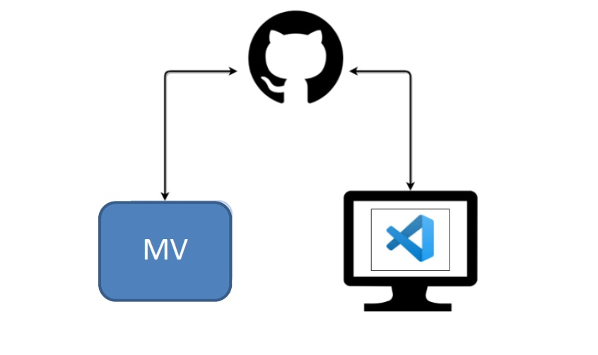

# PRÁCTICA 1.3 TRABAJANDO CON UN REPOSITORIO REMOTO EN GITHUB
## 1. INTRODUCCIÓN
En esta actividad crearemos un repositorio remoto en [GitHub](https://github.com/) al que nos conectaremos con dos usuarios diferentes. Para simular que tenemos dos usuarios emplearemos nuestra máquina local y una MV con Ubuntu y git instalado. En la MV usaremos git desde consola y realizaremos cambios en el repositorio. En nuestra máquina local usaremos la interfaz gráfica de git de nuestro editor de código favorito ( VSCode. Crearemos ramas, las sincronizaremos con el repositorio remoto y resolveremos conflictos, y veremos cómo hacerlo tanto desde la consola como desde la interfaz de VSCode.

## 2. CREANDO EL ESCENARIO
### 2.1 Configuración del Repositorio
En primer lugar, si no tienes cuenta en GitHub, debes crear una.  
Crea un nuevo repositorio.  
Dale un nombre, _**(DawAct1_4)**_ y especifica que será un repositorio público. De esta manera cualquier persona podrá verlo en la web, pero sólo usuarios autorizados podrán modificarlo. Selecciona además que se añada un archivo README.md  
**(OJO: En las capturas, el nombre del repositorio es DawAct4_1, pero es un lapsus)**  
Ya tenemos el repositorio, con un archivo README.md  
### 2.2 Puesta a punto del cliente en una MV (GitClient)
En nuestra MV Ubuntu Server, que en esta práctica llamaremos GitClient, ya debemos tener instalado Git. Si no es así, instálalo.  
Esta MV se conectará a GitHub utilizando una conexión SSH. <ins>Para ello necesitamos crear una la clave privada en la MV.</ins>  
Primero crearemos un directorio _.ssh_, en el directorio home de nuestro usuario, para guardar claves privadas   
```
$ cd /home/ubuntu-user
$ mkdir .ssh
```
Después creamos la clave con el siguiente comando, sustituyendo el correo por el que has usado en GitHub: 
```
ssh-keygen -t ed25519 -C "your_email@example.com"
```
Esto crea una llave SSH utilizando el correo electrónico proporcionado como etiqueta. 
